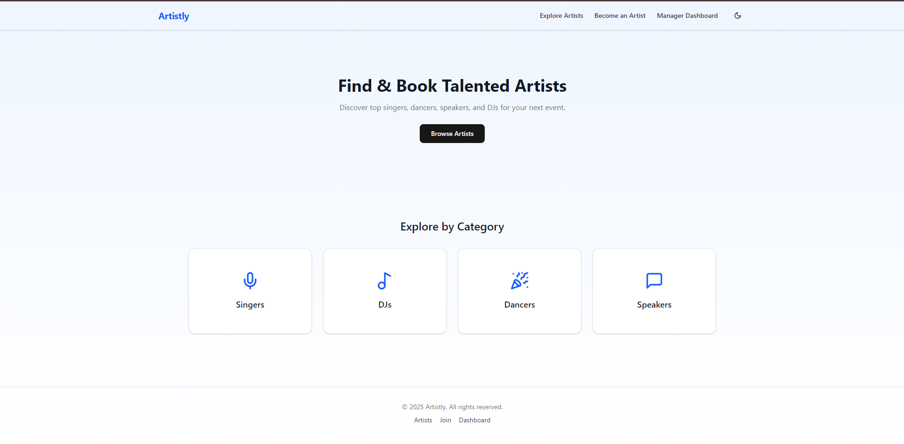
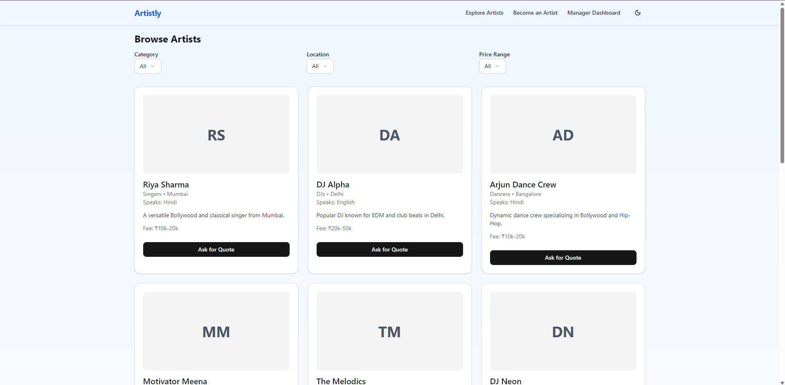
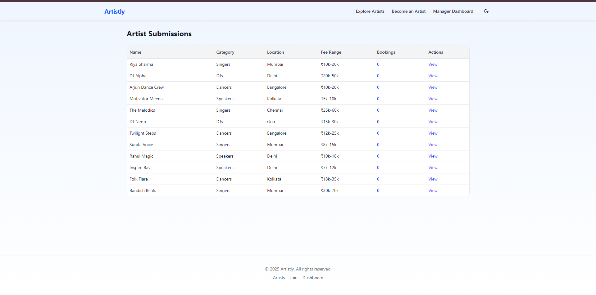

# 🎨 Artistly — Talent Booking Frontend Web App

Artistly is a modern, responsive talent booking platform built with **Next.js 15+ (App Router)**, **React**, **Tailwind CSS**, and **ShadCN UI**. It allows users to explore artists, onboard new talent, and manage artist requests — all with a smooth UI and dark mode support.

---

## ✨ Features

- 🌟 Homepage with category highlights and call-to-action
- 🎤 Artist listing with filters (category, location, price)
- 📝 Multi-step artist onboarding form (React Hook Form + Zod)
- 🧮 Manager dashboard with booking analytics
- 🧾 Booking modal with approve/decline and localStorage sync
- 🌗 Full dark mode support
- ⚡ Fast, responsive UI with component reuse
- 💾 LocalStorage used as mock backend for persistence

---

## 📷 Screenshots

| Homepage | Artist Listing | Dashboard |
|---------|----------------|-----------|
|  |  |  |

---

## 🛠 Tech Stack

- **Next.js 13+** (App Router)
- **React Functional Components**
- **Tailwind CSS** (utility-first styling)
- **ShadCN UI** (accessible and themeable components)
- **React Hook Form** + **Zod** (form handling and validation)
- **localStorage** for mock database
- **Sonner** for toast notifications

---

## 🚀 Getting Started

### 1. Clone the repo

```bash
git clone https://github.com/your-username/artistly.git
cd artistly
npm install
```
*It installs all the necessary modules required to run the code.*
## 2. For Development
```bash
npm run dev
```
*It opens in your browser at http://localhost:3000 with a live preview.*
## 3. For Deployment 

```bash
npm run build
npm rnun start
```
*It opens in your browser at http://localhost:3000.*
## 🧪 To Test
- Submit a new artist via ```/onboard```
- See them appear in ```/artists``` and ```/dashboard```
- Click **"Ask for Quote"** → submit form
- Booking gets stored and shown in dashboard
- Try **approve/decline** to remove the booking

## Author

- Made with ❤️ by  [@ayush](https://www.github.com/ayushdasgupta)
